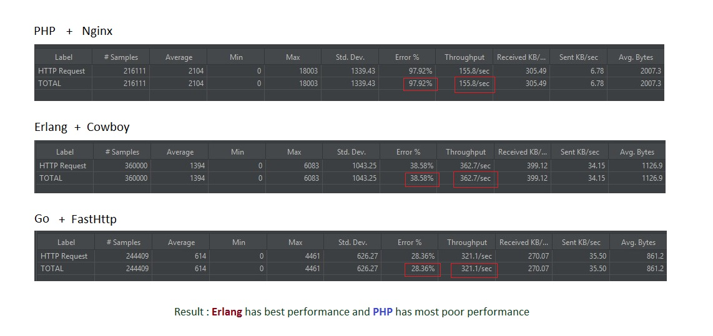

# erlang_examples
Collection of source codes which demonstrate all features of ERLANG 

#### Sample
```erlang
-module(hello_world).
-export([hello/0]).

hello() ->
    io:format("hello world~n").
```

#### Compile by Make

```console
$ make module=hello_world init=hello
compiling ...
running ...
hello world
```

#### Compile by Erlang

##### Compile the erlang program
```console
$ erlc helloworld.erl
```

##### Execute the erlang Program
```console
$ erl -noshell -s helloworld start -s init stop
```

##### Erlang one liner
```console
$ erl -noshell -eval 'io:fwrite("Hello, World!\n"), init:stop().'
```

#### Benchmarking Http Time Server (Erlang vs PHP vs GO)

**Windows** 8.1 64bit

CPU: Intel Core i3 6100U 2.30GHz, RAM: 8 GB DDR3 DRAM 800MHz

**Apache JMeter** (15000 concurrent users for 3 times, each time duration 30 seconds)

**PHP** 7.4 64bit Nginx 32bit 1.19.5 (latest)

**Go** 1.16.3 64 bit (latest)

**Erlang** 23 64 bit, emulator 11.1.4, cowboy (latest)


